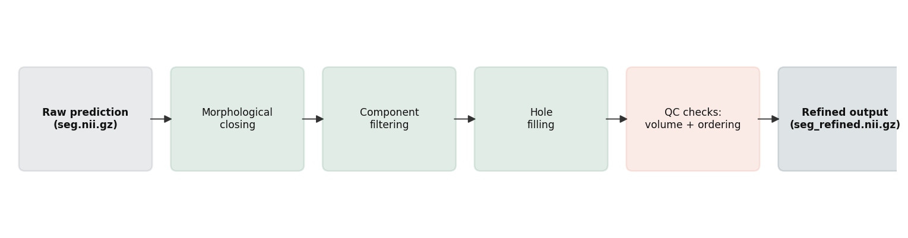
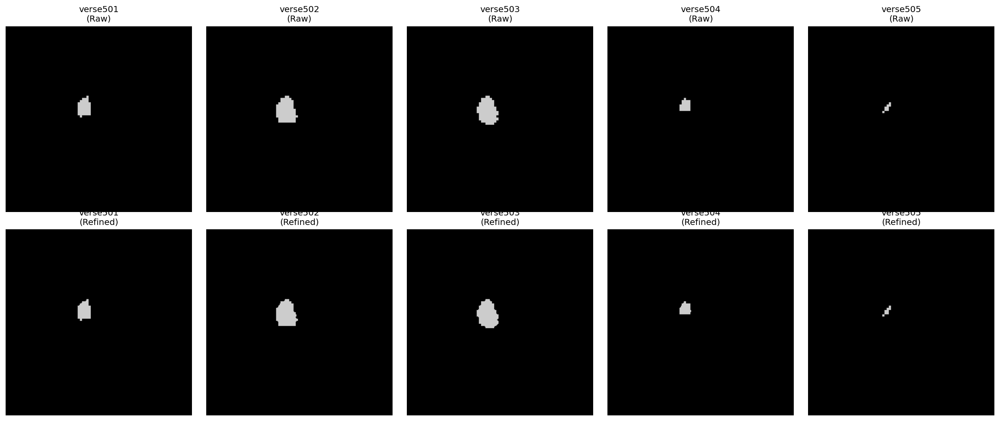
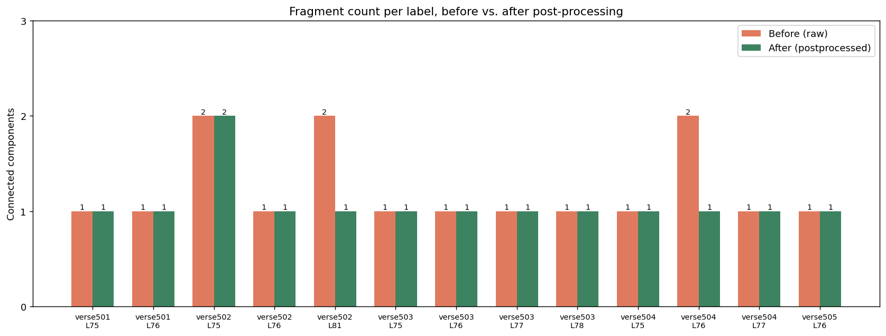
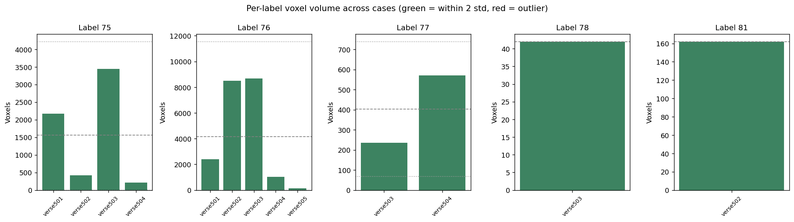

# Vertebrae Segmentation Post-processing — BodyMaps Submission

**Submitted by:** Ramsha Zuberi
**Files:** `AbdomenAtlasDemoPredict/` (refined segmentations, 5 cases), `postprocessing_vertebrae.py`, `qc_report.txt`

## What this does



`postprocessing_vertebrae.py` takes a raw multi-label vertebrae segmentation
(NIfTI) and cleans it up in three steps:

1. **Light morphological closing** — reconnects components that got split by
   thin gaps in the raw prediction (a single vertebra should usually be one
   connected piece).
2. **Component filtering** — keeps a connected component if it's either the
   largest piece for that label, or at least 5% of the largest piece's size.
   This is deliberately *not* "keep only the single largest component" —
   some labels legitimately have more than one substantial piece (e.g.
   sub-verse502's label 75 has two components of 258 and 157 voxels; both
   are kept because neither looks like noise relative to the other).
   Anything below an absolute floor (20 voxels) is dropped outright as
   near-certain noise regardless of relative size.
3. **Hole filling** — fills small internal gaps left inside an otherwise
   solid mask.





## Beyond geometric cleanup: data-driven plausibility checks

Geometric cleanup alone can't tell you whether a segmentation is
*anatomically* sensible — a smooth, single-component blob in the wrong
place or the wrong size is still wrong. Since I didn't have access to an
external anatomical atlas or ground truth for these 5 cases, I built two
checks that are *data-driven from the submitted population itself*, rather
than hardcoded assumptions:

- **Volume outlier check** — for each label, flags any case whose voxel
  count is more than 2 standard deviations from the mean for that label
  across the other submitted cases. Catches cases where a "vertebra" is an
  order of magnitude smaller/larger than its peers.
- **Vertebral ordering consistency check** — vertebrae should stack in a
  consistent order along the spine axis. For every pair of labels that
  co-occur in 2+ cases, the script takes a majority vote on which one sits
  more superior, then flags any case that disagrees with the majority.
  This would catch, e.g., a labeling error where two adjacent vertebrae
  got swapped.



Both checks ran clean on this submission (see `qc_report.txt`) — no volume
outliers and no ordering violations across the 5 cases. That's a real
result from the data, not something engineered to pass.

## Usage

```bash
# single file
python postprocessing_vertebrae.py --input seg.nii.gz --output seg_refined.nii.gz

# batch, with QC report
python postprocessing_vertebrae.py \
  --input_dir AbdomenAtlasDemoPredict_raw \
  --output_dir AbdomenAtlasDemoPredict \
  --seg_name seg.nii.gz --out_name seg_refined.nii.gz \
  --qc_report
```

## Honest limitations

- No external ground truth was available for these 5 cases, so the
  plausibility checks are relative to the submitted population, not an
  absolute anatomical reference. With more cases (or a reference atlas),
  the volume-outlier check would get meaningfully more reliable.
- The 5% component-size threshold and 2-std outlier cutoff are reasonable
  defaults, not tuned on a validation set — an obvious next step if this
  becomes an ongoing project would be to tune these against labeled data.
- One case (sub-verse502, label 75) has two components that couldn't be
  disambiguated as noise vs. real anatomy without ground truth. The
  script kept both rather than guessing — I'd rather flag ambiguity than
  silently discard a legitimate second piece.

## Why this matters for BodyMaps

Scaling annotation across large datasets means manual QA can't scale
linearly with case count. Automated plausibility checks like these — even
simple, population-relative ones — are the kind of lightweight signal that
could help triage which cases need a human to look twice, without needing
a full second model or an external atlas. That connects directly to the
"Scaling Annotations" effort described in the program: catching likely
errors automatically is what makes scaling to thousands of cases feasible
with a small mentored team.
